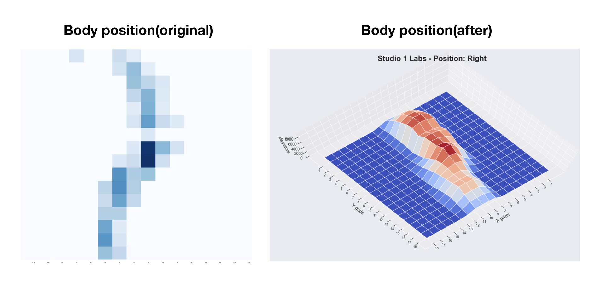

# Studio 1 Labs - Computer Engineering / Data Analyst Intern
#### Core skills: Python, InfluxDB, Linux, Statistics and Machine Learning algorithms

## Table of Contents
- [Patient Monitoring Dashboard](#patient-monitoring-dashboard)
- [Reinforce the 3D Visualization of the positional data](#reinforce-the-3d-visualization-of-the-positional-data)
- [User Interface Visualization](#user-interface-visualization)

---

### Patient Monitoring Dashboard 
### (Published on [EETimes Asia](https://www.eetasia.com/covid-19-getting-to-grips-with-respiration/))

#### Aims: Respiratory and Position monitor system for patient on our bedsheet device

#### 3D figures below represent the patient's posture and location currently on our device, with special algorithms, we can then filter out the chest location and do the signal processing to present breathing pattern of the patient.

---

### Reinforce the 3D Visualization of the positional data
#### Aims: Strengthen the visualization with mathematical signal processing procedure.

#### Left is the graph directly drawn from the raw data, after smoothing and singal processing procedures, we are able to output informative graph(posture and location) as the right one.

---
### User Interface Visualization
Aims: In charge of connecting InfluxDB, data processing and FlaskAPI to dump data to front-end.

